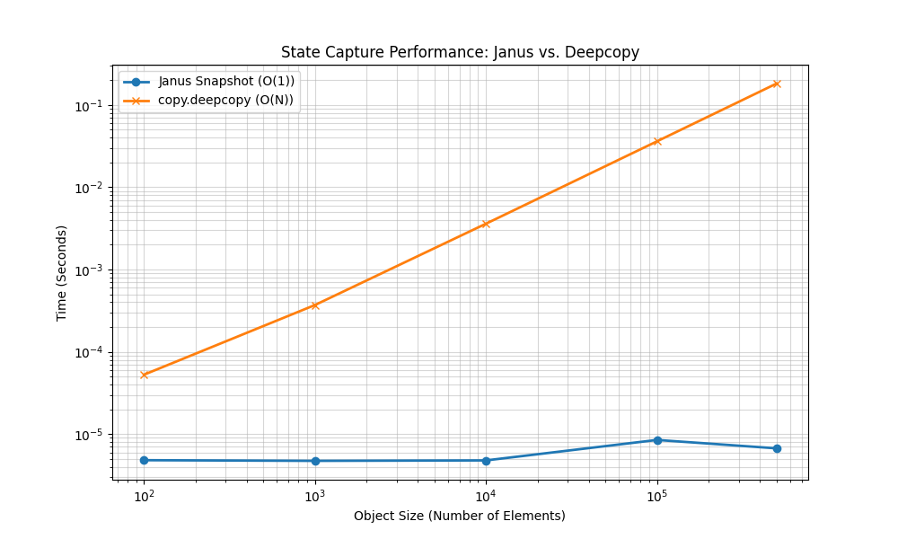

# Janus Performance Analysis ⚡

This document details the performance characteristics and architectural advantages of the Janus multiversal state engine.

## 🏗️ Architectural Overview

Janus replaces the traditional "snapshot-and-copy" pattern with a **persistent delta-log** implemented in Rust (`Tachyon-RS`).

### 1. $O(1)$ State Logging

In Python, capturing the state of an object typically requires a deepcopy. As the object size $N$ increases, the time complexity for state capture scales as $O(N)$.

Janus intercepts attribute mutations via the `JanusBase` class (inherited by `TimelineBase` and `MultiverseBase`) and logs these as discrete deltas in the Rust engine. Consequently, "snapshotting" (or branching) an object's state is reduced to simply recording the current `NodeId` in the engine's internal Direct Acyclic Graph (DAG). This reduces the cost of state capture from $O(N)$ to **$O(1)$**.

### 2. Bi-directional DAG Traversal

State restoration between arbitrary points in the DAG is optimized using a **Lowest Common Ancestor (LCA)** algorithm. To move from `Node A` to `Node B`, the engine:

1. Identifies the path from `A` to the LCA of `A` and `B`.
2. Identifies the path from the LCA to `B`.
3. Applies inverse deltas to travel up to the LCA, and forward deltas to reach `B`.

The complexity of state restoration is $O(D)$, where $D$ is the path distance in the DAG, making it independent of the total history size.

---

## 📊 Benchmark Data

Benchmarks were conducted on a machine with a 3.12 Python environment and an optimized Rust extension.

### 1. Logging Latency vs. History Depth

This test verifies the engine's constant-time logging capability.

| History Depth (Nodes) | Mean Latency (ns) |
| :--- | :--- |
| 1,000 | 7,111 |
| 10,000 | 6,792 |
| 50,000 | 6,560 |
| 100,000 | **6,728** |

**Conclusion**: The latency ratio (100k/1k) of **0.95x** confirms that the engine's overhead does not increase with the size of the history graph.

### 2. Janus Snapshot vs. `copy.deepcopy`

This comparison demonstrates the divergence between delta-logging and full-copy architectures.

| Object Size (N) | Janus Snapshot (s) | `copy.deepcopy()` (s) | Speedup |
| :--- | :--- | :--- | :--- |
| 100 | 0.00000482 | 0.00005267 | ~11x |
| 10,000 | 0.00000479 | 0.00360782 | ~750x |
| 100,000 | 0.00000849 | 0.03618680 | ~4,200x |
| 500,000 | **0.00000671** | **0.18233373** | **~27,000x** |

**Takeaway**: For large-scale AI states or data science objects, Janus provides near-instantaneous state capture that would otherwise be cost-prohibitive with standard Python utilities.

---

## ⚖️ Technical Considerations

### Bridge Overhead

The primary performance bottleneck in Janus is the CPython/Rust boundary (via `PyO3`). Every attribute update incurs a cross-boundary call. While this is extremely fast (measured at ~7μs), it is slower than a raw Python attribute set.

**Recommendation**: Janus is most effective for objects where state capture frequency is high relative to the frequency of raw compute operations, or where the objects themselves are large enough that deepcopying becomes the primary bottleneck.

### Memory Footprint

While logging is $O(1)$ time, it is $O(H)$ space, where $H$ is the number of mutations. To prevent excessive memory growth, Janus will implement a **Tombstone Strategy** (Phase 5 of the roadmap) to prune unreachable nodes or squash linear segments.
