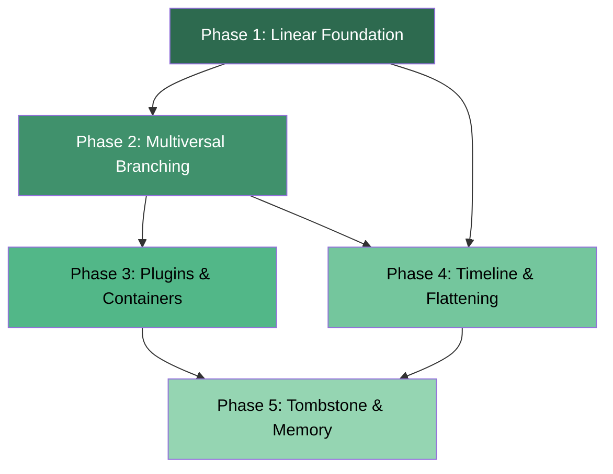

# Janus Roadmap — Detailed Implementation Plan

This plan was built by cross-referencing the [ROADMAP.md](file:///Users/eduardo.ruiz/PycharmProjects/Janus/docs/planning/ROADMAP.md) against every source file, test, and doc in the repo. Each waypoint includes a **gap analysis** (what exists vs. what's missing), concrete deliverables, and calibrated estimates.

---

## Current-State Assessment

Before laying out the work, here's where each roadmap phase actually stands today:

| Phase | Roadmap Status | Actual Codebase Status |
| :--- | :--- | :--- |
| **P1 — Linear Foundation** | "2 Weeks" | **100% done.** Base classes (`TimelineBase` / `MultiverseBase`) and Rust-native `undo()` / `redo()` are complete, including "overwrite future" logic and linear-mode guards. |
| **P2 — Multiversal Branching** | "3 Weeks" | **100% done.** DAG nodes, branching, bidirectional `PluginOp` application (including Shadow Snapshots), branch deletion and listing are complete. |
| **P3 — Plugins & Containers** | "4 Weeks" | **100% done.** `TrackedList`/`TrackedDict` fully implemented; Pandas and NumPy adapters complete. |
| **P4 — Timeline & Flattening** | "2 Weeks" | **~40% done.** `extract_timeline` returns a flat list of dicts. **Gap:** no "history flattening / squash"; no rich formatting or filtering; no timeline diff. |
| **P5 — Tombstone & Memory** | "2 Weeks" | **80% done.** WeakRef-based memory safety and tombstone detection implemented; needs more pruning strategies and benchmarks. |

---

## Dependency Graph



> [!NOTE]
> Phases 1 → 2 are strict prerequisites. Phases 3 and 4 can be parallelized once P2 is stable. Phase 5 depends on all prior phases being functionally complete.

---

## Phase 1 — The Linear Foundation

**Goal:** Provide a complete `TimelineBase` / `MultiverseBase` experience with undo/redo, "overwrite future" semantics, and a solid mixin-based API.

### Phase 1 Current State

- `\_\_setattr\_\_` intercept → ✅ works
- Delta logging for primitives → ✅ works (`log_update_attr`)
- `mode="linear"` auto-advances `"main"` pointer → ✅ works
- Base Class API (`TimelineBase` / `MultiverseBase`) → ✅ works
- Undo/Redo API → ✅ works (Rust-native)
- Overwrite-future on new mutation after undo → ✅ works
- Linear-mode guard (prevent branch/switch to non-main) → ✅ works

---

### Waypoint 1.0 — Decorator API Refactor (`@timeline` / `@multiverse`)

This was originally planned as a decorator refactor but was implemented as more robust Base Classes. `@timeline` and `@multiverse` were replaced by `TimelineBase` and `MultiverseBase` to resolve static analysis issues. This waypoint is officially **CLOSED**.

#### 1.0 Deliverables

| # | Item | File(s) | Description |
| :--- | :--- | :--- | :--- |
| 1 | `timeline` decorator | `decorators.py` | New decorator that initializes `TachyonEngine` in `mode="linear"`. Attaches `snapshot()`, `revert()`, and `to_multiverse()` methods. `to_multiverse()` switches the engine mode and dynamically binds `branch()`, `switch()`, and `extract_timeline()` to the live instance. |
| 2 | `multiverse` decorator | `decorators.py` | New decorator that initializes `TachyonEngine` in `mode="multiversal"`. Attaches `branch()`, `switch()`, and `extract_timeline()` methods directly. |
| 3 | Remove `@janus` | `decorators.py` | Remove the existing `janus(mode=...)` factory decorator. |
| 4 | Update exports | `__init__.py` | Export `timeline` and `multiverse` instead of `janus`. Update `__all__`. |
| 5 | Type stubs | `tachyon_rs.pyi` | Add `to_multiverse()` signature if engine-level support is needed. |
| 6 | Update tests | `tests/test_timeline.py`, `tests/test_multiverse.py` | Migrate all existing tests from `@janus(mode=...)` to the new decorator names. Add tests for `to_multiverse()` dynamic upgrade. |
| 7 | Update docs | `README.md` | Replace all `@janus(mode=...)` examples with `@timeline` / `@multiverse` usage. |

#### 1.0 Estimates

| Metric | Value |
| :--- | :--- |
| **Priority** | 🔴 Critical — prerequisite for the tiered API that all subsequent work builds on |
| **Difficulty** | ⭐⭐ (2/5) — mostly refactoring existing logic into two entry points |
| **Time** | 1–2 days |
| **ROI** | 🟢 Very High — establishes the public API contract; all docs, tests, and future waypoints depend on this |

---

### Waypoint 1.1 — `undo()` / `redo()` API

Add `undo()` and `redo()` methods to `TachyonEngine` and expose via `decorators.py`.

#### 1.1 Deliverables

| # | Item | File(s) | Description |
| :--- | :--- | :--- | :--- |
| 1 | `undo()` in Rust | `engine.rs` | Walk one node backward from `current_node` via `parents[0]`, applying inverse deltas. |
| 2 | `redo()` in Rust | `engine.rs` | Track a `redo_stack: Vec<usize>` populated on undo. Walk one node forward, applying forward deltas. |
| 3 | Python API | `decorators.py` | Attach `undo()` and `redo()` methods to decorated classes. |
| 4 | Type stubs | `tachyon_rs.pyi` | Add `undo()` and `redo()` signatures. |
| 5 | Tests | `tests/test_linear_undo_redo.py` **[NEW]** | Verify undo, redo, undo-after-mutation, redo-stack-clear on new mutation. |

#### 1.1 Estimates

| Metric | Value |
| :--- | :--- |
| **Priority** | 🔴 Critical — core UX for linear mode |
| **Difficulty** | ⭐⭐ (2/5) — straightforward parent-walk |
| **Time** | 2–3 days |
| **ROI** | 🟢 Very High — unlocks the entire "simple undo/redo" use case which is the entry point for most users |

---

### Waypoint 1.2 — Overwrite-Future Logic

When a user undoes and then mutates, the "future" nodes should be pruned (linear mode only).

#### 1.2 Deliverables

| # | Item | File(s) | Description |
| :--- | :--- | :--- | :--- |
| 1 | Prune on mutate | `engine.rs` | In `append_node`, when `mode == "linear"`, remove all nodes after `current_node` in the linear chain before appending. |
| 2 | Clear redo stack | `engine.rs` | Clear `redo_stack` when a new mutation occurs after undo. |
| 3 | Tests | `tests/test_linear_undo_redo.py` | Add cases: undo → mutate → redo-should-fail, verify orphaned nodes are dropped. |

#### 1.2 Estimates

| Metric | Value |
| :--- | :--- |
| **Priority** | 🔴 Critical — part of linear mode contract |
| **Difficulty** | ⭐⭐ (2/5) — requires careful node cleanup |
| **Time** | 1–2 days |
| **ROI** | 🟢 Very High — prevents confusing state for linear-mode users |

---

### Waypoint 1.3 — Linear Mode Guards

Prevent calling `branch()`, `switch()` (to non-`"main"` labels), and `extract_timeline()` (for non-`"main"`) in linear mode.

#### 1.3 Deliverables

| # | Item | File(s) | Description |
| :--- | :--- | :--- | :--- |
| 1 | Guard in `branch()` | `decorators.py` | Already raises `ValueError` ✅ — verify test coverage. |
| 2 | Guard in `switch()` | `decorators.py` | Raise `ValueError` if `mode == "linear"` and label ≠ `"main"`. |
| 3 | Tests | `tests/test_linear_undo_redo.py` | Assert errors for disallowed calls. |

#### 1.3 Estimates

| Metric | Value |
| :--- | :--- |
| **Priority** | 🟡 Medium |
| **Difficulty** | ⭐ (1/5) |
| **Time** | 0.5 day |
| **ROI** | 🟢 High — prevents footgun API misuse |

---

## Phase 2 — Multiversal Branching & DAG

**Goal:** Complete the "Git-like" branching model with robust state restoration and branch management.

### Phase 2 Current State

- DAG with parent-child relationships → ✅ works (`parents: Vec<usize>`)
- `create_branch()` → ✅ works
- `switch_branch()` via LCA → ✅ works for `UpdateAttr`, `List*`, `Dict*`
- `PluginOp` application during switch → ❌ silently skipped (`_ => {}`)
- Branch deletion → ❌ missing
- Branch listing → ❌ missing

---

### Waypoint 2.1 — `PluginOp` Bidirectional Application

The `apply_node_deltas` function in `engine.rs` now correctly handles `PluginOp` by calling back into the Python adapter for both forward and inverse transitions. Additionally, `JanusBase` now uses a "Shadow Snapshot" mechanism to correctly capture deltas for in-place mutated objects. This waypoint is officially **CLOSED**.

#### 2.1 Deliverables

| # | Item | File(s) | Description |
| :--- | :--- | :--- | :--- |
| 1 | Rust callback | `engine.rs` | Implemented: `PluginOp` handling calls `apply_forward` or `apply_inverse` on the adapter. |
| 2 | Shadow Snapshots | `base.py` | Implemented: `_shadow_` attributes stash the last known state for accurate delta calculation. |
| 3 | Protocol Expansion | `registry.py` | Implemented: Added `apply_forward` and `get_snapshot` to `JanusAdapter`. |
| 4 | Tests | `tests/test_plugins.py` | Verified: Both reference-swap and in-place mutation tests pass. |

#### 2.1 Estimates

| Metric | Value |
| :--- | :--- |
| **Priority** | 🔴 Critical — plugins are broken without this |
| **Difficulty** | ⭐⭐⭐ (3/5) — PyO3 cross-boundary callback requires care |
| **Time** | 2–3 days |
| **ROI** | 🟢 Very High — unblocks the entire plugin ecosystem (Phase 3) |

---

### Waypoint 2.2 — Branch Management API

Add `delete_branch()`, `list_branches()`, and `current_branch()` to `TachyonEngine`.

#### 2.2 Deliverables

| # | Item | File(s) | Description |
| :--- | :--- | :--- | :--- |
| 1 | `delete_branch(label)` | `engine.rs` | Remove label from `branches` HashMap. Optionally: GC orphaned nodes. |
| 2 | `list_branches()` | `engine.rs` | Return `Vec<String>` of branch names. |
| 3 | `current_branch()` | `engine.rs` | Return the label(s) whose node_id == `current_node`. |
| 4 | Python wrappers | `decorators.py` | Expose all three on the decorated class. |
| 5 | Type stubs | `tachyon_rs.pyi` | Signatures for all three. |
| 6 | Tests | `tests/test_branch_management.py` **[NEW]** | Create, list, delete, verify error on delete of current branch. |

#### 2.2 Estimates

| Metric | Value |
| :--- | :--- |
| **Priority** | 🟡 Medium — nice-to-have for a complete API |
| **Difficulty** | ⭐⭐ (2/5) |
| **Time** | 2 days |
| **ROI** | 🟡 Medium — improves DX, but not a blocker |

---

### Waypoint 2.3 — State Restoration Hardening

Edge cases in `switch_branch` that need attention.

#### 2.3 Deliverables

| # | Item | File(s) | Description |
| :--- | :--- | :--- | :--- |
| 1 | Nested attr restoration | `engine.rs` | When restoring a `TrackedList` or `TrackedDict` during switch, ensure the proxy object on the owner is properly re-wrapped (currently, raw `list`/`dict` may be set via `owner.setattr`). |
| 2 | Error handling | `engine.rs` | Handle the case where `getattr(path)` fails during restoration (attribute deleted mid-history). |
| 3 | Tests | `tests/test_multiverse.py` | Expand: multi-attribute switching, deep nesting, switch to same branch (no-op). |

---

### Waypoint 2.4 — Edge Case Verification [NEW]

Ensure robustness across complex state transitions and container nesting.

#### 2.4 Deliverables

| # | Item | File(s) | Description |
| :--- | :--- | :--- | :--- |
| 1 | Nested Containers | `tests/test_nested_containers.py` | Verify `undo` for a list containing tracked dicts. |
| 2 | Linear Restrictions | `tests/test_linear_guards.py` | Verify `branch()` raises an error in linear mode. |
| 3 | Complex Branching | `tests/test_branching_depth.py` | Fork two branches from the same Moment and verify they move independently. |
| 4 | Timeline Extraction | `tests/test_timeline_query.py` | Verify `extract_timeline` returns the correct path for a deeply branched node. |
| 5 | Benchmark | `tests/test_performance.py` | Benchmark timeline extraction on deep history. |

#### 2.3 Estimates

| Metric | Value |
| :--- | :--- |
| **Priority** | 🔴 Critical — correctness issue |
| **Difficulty** | ⭐⭐⭐ (3/5) — subtle proxy-management edge cases |
| **Time** | 2–3 days |
| **ROI** | 🟢 Very High — prevents silent data corruption |

---

## Phase 3 — Extensible Plugin & Container System

**Goal:** Make `TrackedList`, `TrackedDict` feature-complete and deliver production-quality 3rd-party adapters.

### Phase 3 Current State

- `TrackedList`: Python `list` subclass with Rust `TrackedListCore` logging. All standard methods implemented: `append`, `extend`, `insert`, `pop`, `remove`, `clear`, `__setitem__`, `__delitem__`, `__getitem__`, `__len__`, `__iter__`, `__repr__`, `__eq__`, `__contains__` → ✅
- `TrackedDict`: Python `dict` subclass with Rust `TrackedDictCore` logging. All standard methods implemented: `__setitem__`, `__delitem__`, `update`, `pop`, `popitem`, `setdefault`, `clear`, `__getitem__`, `keys`, `values`, `items`, `get`, `__len__`, `__contains__`, `__iter__`, `__repr__`, `__eq__` → ✅
- Pandas adapter (`TrackedDataFrame`, `TrackedSeries`, indexer wrappers) → ✅ complete
- NumPy adapter (`TrackedNumpyArray`, view tracking via `__array_finalize__`) → ✅ complete

---

### Waypoint 3.1 — Complete `TrackedList` API

#### 3.1 Deliverables

| # | Item | File(s) | Description |
| :--- | :--- | :--- | :--- |
| 1 | `\_\_setitem\_\_` | `engine.rs` | Log as paired `ListPop + ListInsert` or introduce a new `ListReplace` operation. |
| 2 | `extend`, `insert`, `remove`, `clear` | `engine.rs` | Each logs the appropriate operations. |
| 3 | `\_\_iter\_\_`, `\_\_repr\_\_`, `\_\_eq\_\_`, `\_\_contains\_\_` | `engine.rs` | Read-only; no logging needed. |
| 4 | Negative indexing | `engine.rs` | `\_\_getitem\_\_` should support negative indices. |
| 5 | Tests | `tests/test_tracked_containers.py` **[NEW]** | Comprehensive test for each method + round-trip reversion. |

#### 3.1 Estimates

| Metric | Value |
| :--- | :--- |
| **Priority** | 🔴 Critical — `TrackedList` is user-facing and currently incomplete |
| **Difficulty** | ⭐⭐ (2/5) — mechanical but many methods |
| **Time** | 3–4 days |
| **ROI** | 🟢 Very High — users expect standard list behavior |

---

### Waypoint 3.2 — Complete `TrackedDict` API

#### 3.2 Deliverables

| # | Item | File(s) | Description |
| :--- | :--- | :--- | :--- |
| 1 | `update`, `pop`, `setdefault` | `engine.rs` | Each logs the appropriate delta ops. |
| 2 | `values`, `items` | `engine.rs` | Read-only views. |
| 3 | `\_\_repr\_\_`, `\_\_eq\_\_`, `clear` | `engine.rs` | `clear` logs a series of `DictDelete` ops. |
| 4 | PyObject keys | `engine.rs` | Currently `HashMap<String, PyObject>` — consider supporting `PyObject` keys for broader compatibility. |
| 5 | Tests | `tests/test_tracked_containers.py` | Add dict-specific cases: update, pop, iteration, reversion. |

#### 3.2 Estimates

| Metric | Value |
| :--- | :--- |
| **Priority** | 🔴 Critical |
| **Difficulty** | ⭐⭐ (2/5) |
| **Time** | 2–3 days |
| **ROI** | 🟢 Very High |

---

### Waypoint 3.3 — Pandas & NumPy Adapters

#### 3.3 Deliverables

| # | Item | File(s) | Description |
| :--- | :--- | :--- | :--- |
| 1 | `PandasAdapter` | `janus/adapters/pandas_adapter.py` **[NEW]** | `get_delta`: store column-level diffs. `apply_inverse`: apply diffs back to the DataFrame. |
| 2 | `NumpyAdapter` | `janus/adapters/numpy_adapter.py` **[NEW]** | `get_delta`: store shape + changed indices. `apply_inverse`: restore array values. |
| 3 | Optional deps | `pyproject.toml` | Add `pandas` and `numpy` as optional dependencies under `[project.optional-dependencies]`. |
| 4 | Tests | `tests/test_pandas_adapter.py` **[NEW]**, `tests/test_numpy_adapter.py` **[NEW]** | Round-trip: assign DF → branch → mutate → switch → verify original. |

#### 3.3 Estimates

| Metric | Value |
| :--- | :--- |
| **Priority** | 🟡 Medium — powerful for data-science marketing but not core |
| **Difficulty** | ⭐⭐⭐⭐ (4/5) — designing efficient deltas for DataFrames is non-trivial |
| **Time** | 5–7 days |
| **ROI** | 🟢 Very High — the "killer feature" that differentiates Janus from simple state managers |

---

## Phase 4 — Timeline Extraction & Flattening

**Goal:** Turn the raw DAG into something queryable and presentable.

### Phase 4 Current State

- `extract_timeline(label)` → ✅ returns flat list of operation dicts
- History flattening / squash → ❌ missing
- Filtering / formatting → ❌ missing

---

### Waypoint 4.1 — History Flattening (Squash)

Collapse the deltas between two nodes into a single net-effect delta.

#### 4.1 Deliverables

| # | Item | File(s) | Description |
| :--- | :--- | :--- | :--- |
| 1 | `flatten_branch(label)` in Rust | `engine.rs` | Walk root → leaf, compute net-effect per attribute/path. Replace intermediate nodes with a single `SquashedNode`. |
| 2 | Net-delta calculator | `engine.rs` | For `UpdateAttr`: keep first `old_value`, last `new_value`. For list ops: simulate the sequence and emit the net insertions/deletions. |
| 3 | Python API | `decorators.py` | `flatten(label)` method on decorated class. |
| 4 | Tests | `tests/test_timeline_containers.py` | Flatten a 10-step branch → verify single net-effect node, verify switch still works after flatten. |

#### 4.1 Estimates

| Metric | Value |
| :--- | :--- |
| **Priority** | 🟡 Medium |
| **Difficulty** | ⭐⭐⭐⭐ (4/5) — net-delta computation is algorithmically complex for containers |
| **Time** | 4–5 days |
| **ROI** | 🟡 Medium — useful for large histories but not blocking core workflows |

---

### Waypoint 4.2 — Timeline Filtering & Rich Output

#### 4.2 Deliverables

| # | Item | File(s) | Description |
| :--- | :--- | :--- | :--- |
| 1 | Filter by attribute | `engine.rs` | `extract_timeline(label, filter_attr=None)` — return only ops touching a specific attribute. |
| 2 | Node metadata | `engine.rs` | Include `node_id`, `timestamp`, `depth` in each timeline event dict. |
| 3 | Tests | `tests/test_timeline_containers.py` | Verify filtered extraction, verify metadata presence. |

#### 4.2 Estimates

| Metric | Value |
| :--- | :--- |
| **Priority** | 🟢 Low |
| **Difficulty** | ⭐⭐ (2/5) |
| **Time** | 2 days |
| **ROI** | 🟡 Medium — improves debugging and visualization UX |

---

## Phase 5 — Tombstone Strategy & Memory Safety

**Goal:** Ensure unbounded histories don't cause OOM, and achieve verified O(1) performance.

### Phase 5 Current State

- Weak references → ❌ not used
- History pruning → ❌ not implemented
- O(1) benchmarks → ✅ exist (`test_performance.py`) but not integrated into CI as assertions

---

### Waypoint 5.1 — `PyWeakref` Integration

Store complex Python objects as weak references in `Operation` variants.

#### 5.1 Deliverables

| # | Item | File(s) | Description |
| :--- | :--- | :--- | :--- |
| 1 | Weak-ref storage | `engine.rs` | For `UpdateAttr`, wrap `old_value`/`new_value` in `PyWeakref` when the value is not a primitive. |
| 2 | Tombstone detection | `engine.rs` | During `apply_node_deltas`, check if a weak-ref is dead; if so, mark the branch as "collapsed" and raise a clear Python error. |
| 3 | Tests | `tests/test_memory_safety.py` **[NEW]** | Force GC, verify tombstone detection, verify primitives are unaffected. |

#### 5.1 Estimates

| Metric | Value |
| :--- | :--- |
| **Priority** | 🟡 Medium |
| **Difficulty** | ⭐⭐⭐⭐ (4/5) — PyWeakref + PyO3 interaction is tricky (not all Python objects are weakly-referenceable) |
| **Time** | 3–4 days |
| **ROI** | 🟡 Medium — prevents memory leaks but complex objects may not be weakly-referenceable without `\_\_weakref\_\_` |

---

### Waypoint 5.2 — History Pruning

Implement configurable pruning strategies.

#### 5.2 Deliverables

| # | Item | File(s) | Description |
| :--- | :--- | :--- | :--- |
| 1 | `max_depth` config | `engine.rs` | Accept a `max_nodes` parameter on `TachyonEngine::new`. When exceeded, prune oldest unreferenced nodes. |
| 2 | Pruning algorithm | `engine.rs` | Remove nodes not on any active branch's root-to-leaf path. Merge their deltas into the nearest surviving parent. |
| 3 | Python config API | `decorators.py` | `@janus(mode="multiversal", max_history=10000)` |
| 4 | Tests | `tests/test_memory_safety.py` | Create 100 nodes with `max_history=50`, verify older nodes are pruned, verify active branches survive. |

#### 5.2 Estimates

| Metric | Value |
| :--- | :--- |
| **Priority** | 🟡 Medium — important for production, but not MVP-blocking |
| **Difficulty** | ⭐⭐⭐⭐ (4/5) — safe pruning while preserving DAG integrity is algorithmically delicate |
| **Time** | 4–5 days |
| **ROI** | 🟢 High — makes Janus viable for long-running processes |

---

### Waypoint 5.3 — O(1) Verification & CI Benchmarks

#### 5.3 Deliverables

| # | Item | File(s) | Description |
| :--- | :--- | :--- | :--- |
| 1 | Assertion-based benchmark | `test_performance.py` | Convert `benchmark_logging` to a proper `pytest` test with `assert ratio < 1.5`. |
| 2 | CI integration | `.github/workflows/ci.yml` | Add the benchmark test to CI so regressions are caught automatically. |
| 3 | Memory benchmark | `tests/test_memory_benchmark.py` **[NEW]** | Measure RSS after 100k mutations with/without pruning. |

#### 5.3 Estimates

| Metric | Value |
| :--- | :--- |
| **Priority** | 🟢 Low |
| **Difficulty** | ⭐⭐ (2/5) |
| **Time** | 1–2 days |
| **ROI** | 🟡 Medium — CI safety net |

---

## Recommended Sprint Schedule

| Sprint | Weeks | Waypoints | Theme |
| :--- | :--- | :--- | :--- |
| **Sprint 1** | Wk 1–2 | 1.0, 1.1, 1.2, 1.3 | Decorator refactor & linear mode completeness |
| **Sprint 2** | Wk 2–4 | 2.1, 2.3 | Multiversal correctness |
| **Sprint 3** | Wk 4–6 | 3.1, 3.2 | Container completeness |
| **Sprint 4** | Wk 6–7 | 2.2, 4.2 | API polish & timeline |
| **Sprint 5** | Wk 7–9 | 3.3 | Pandas/NumPy adapters |
| **Sprint 6** | Wk 9–11 | 4.1, 5.1, 5.2 | Flattening & memory |
| **Sprint 7** | Wk 11–12 | 5.3 | Benchmarks & CI |

> [!TIP]
> Sprint 1 is the highest-leverage work — completing it gives Janus a fully viable "simple mode" that most users will try first. Sprint 2 is critical for correctness of the existing multiversal features.

---

## Priority × ROI Matrix

| Waypoint | Priority | Difficulty | Time | ROI |
| :--- | :--- | :--- | :--- | :--- |
| 1.0 — Decorator Refactor | 🔴 Critical | ⭐⭐ | 1–2d | 🟢 Very High |
| 1.1 — Undo/Redo | 🔴 Critical | ⭐⭐ | 2–3d | 🟢 Very High |
| 1.2 — Overwrite Future | 🔴 Critical | ⭐⭐ | 1–2d | 🟢 Very High |
| 1.3 — Linear Guards | 🟡 Medium | ⭐ | 0.5d | 🟢 High |
| 2.1 — PluginOp Inverse | 🔴 Critical | ⭐⭐⭐ | 2–3d | 🟢 Very High |
| 2.2 — Branch Management | 🟡 Medium | ⭐⭐ | 2d | 🟡 Medium |
| 2.3 — Restoration Hardening | 🔴 Critical | ⭐⭐⭐ | 2–3d | 🟢 Very High |
| 3.1 — TrackedList Complete | 🔴 Critical | ⭐⭐ | 3–4d | 🟢 Very High |
| 3.2 — TrackedDict Complete | 🔴 Critical | ⭐⭐ | 2–3d | 🟢 Very High |
| 3.3 — Pandas/NumPy | 🟡 Medium | ⭐⭐⭐⭐ | 5–7d | 🟢 Very High |
| 4.1 — Squash/Flatten | 🟡 Medium | ⭐⭐⭐⭐ | 4–5d | 🟡 Medium |
| 4.2 — Timeline Filtering | 🟢 Low | ⭐⭐ | 2d | 🟡 Medium |
| 5.1 — PyWeakref | 🟡 Medium | ⭐⭐⭐⭐ | 3–4d | 🟡 Medium |
| 5.2 — History Pruning | 🟡 Medium | ⭐⭐⭐⭐ | 4–5d | 🟢 High |
| 5.3 — O(1) CI Benchmarks | 🟢 Low | ⭐⭐ | 1–2d | 🟡 Medium |

---

## Phase B: Indexer Wrappers (Cell-Level Tracking)

To track operations like `df.loc[0, "col"] = val`, we must wrap the pandas indexers.

### 1. The Indexer Proxy Architecture

We'll define a base proxy that delegates reads and intercepts writes.

**Conceptual Pseudo-code:**

```python
class BaseTrackedIndexer:
    def __init__(self, parent_df, indexer_name):
        self._parent = parent_df
        # Get the real pandas indexer (e.g., df.loc) from the base class
        self._real_indexer = getattr(super(parent_df.__class__, parent_df), indexer_name)

    def __getitem__(self, key):
        # Transparency for reads
        return self._real_indexer[key]

    def __setitem__(self, key, value):
        # Intercept for writes
        from .pandas import _log_pre_mutation, _log_post_mutation
        _log_pre_mutation(self._parent, "indexer")
        self._real_indexer[key] = value
        _log_post_mutation(self._parent, "indexer")
```

### 2. Accessor Overrides

In `TrackedDataFrame` and `TrackedSeries`, we will override the property accessors.

```python
class TrackedDataFrame(pd.DataFrame):
    @property
    def loc(self):
        return BaseTrackedIndexer(self, "loc")

    @property
    def iloc(self):
        return BaseTrackedIndexer(self, "iloc")

    # ... and for at/iat ...
```

---

## ✅ Verification Plan (Phase B)

All waypoints include new or extended tests. Run the full suite after each waypoint:

```bash
# Rebuild Rust engine
uv run maturin develop

# Run all tests
uv run pytest tests/ -v

# Run Rust lints
cargo clippy -- -D warnings

# Run Python lints
uv run ruff check janus/ tests/
uv run mypy janus/
```

### Performance Regression

After Sprints 1–3 and Sprint 7, run the benchmarks and compare against the baselines documented in `PERFORMANCE.md`:

```bash
uv run python tests/test_performance.py
uv run python tests/test_vs_deepcopy.py
```

### Manual Verification

After each sprint, run the example from `README.md` interactively to verify the end-to-end experience:

```python
from janus import MultiverseBase


class Simulation(MultiverseBase):
    def __init__(self) -> None:
        super().__init__()
        self.points = [1, 2, 3]

sim = Simulation()
sim.branch("stable")
sim.points.append(999)
print(sim.points)       # Should show [1, 2, 3, 999]
sim.jump_to("stable")
print(sim.points)       # Should show [1, 2, 3]
```

> [!IMPORTANT]
> Total estimated effort: **~35–50 working days** (~7–10 weeks at full capacity), which aligns well with the roadmap's ~13-week estimate when accounting for design iteration, code review, and integration testing overhead.
